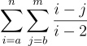

# Лабораторна робота №1 студента групи ІМ-12 Сутулова Нікіти Олеговича

Тема:
Основні типи та оператори мови програмування Java.  
Мета:
Ознайомлення з основними типами та операторами в Java. Здобуття навичок у використанні типів та операторів в Java.

[Умова лабораторної роботи знаходиться тут.](https://asdjonok.github.io/OOP-SITE/)

Номер залікової книжки: 1229
- С2 - остача від ділення номера залікової книжки на 2:   
  = 1229 % 2 = 1 => **O1 = "-"**

- С3 - остача від ділення номера залікової книжки на 3:  
  = 1229 % 3 = 2 => **C = 2**

- С5 - остача від ділення номера залікової книжки на 5:  
  = 1229 % 5 = 4 => **O2 = "-"**

- С7 - остача від ділення номера залікової книжки на 7:  
  = 1229 % 7 = 4 => **Тип i та j - "char"**

Загальна формула:

Для того, щоб запустити програму, необхідно встановити IntelliJ IDEA, або іншу IDE, яка підтримує розробку мовою Java, в ній відкрити файл Main.java та запустити його (гарячі клавіші за замовченням - Shift+F10).