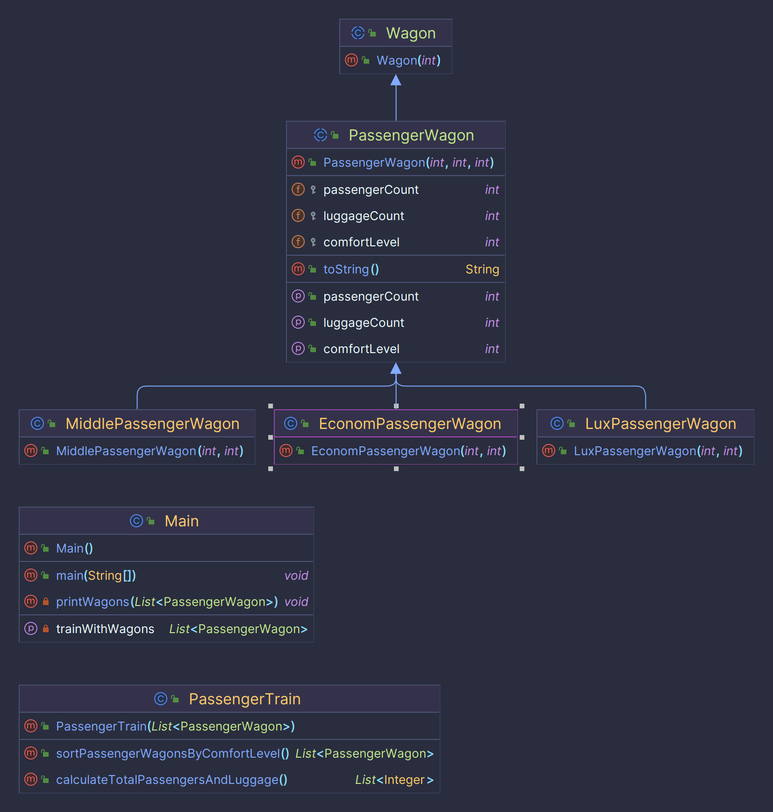

# Лабораторна робота №6 студента групи ІМ-12 Сутулова Нікіти Олеговича

Тема:
Наслідування та поліморфізм.

Мета:
Ознайомлення з механізмом наслідування та принципом поліморфізму.
Використання механізму наслідування та принципу поліморфізму в мові
Java. Здобуття навичок у використанні механізму наслідування та принципу
поліморфізму.

[Умова лабораторної роботи знаходиться тут.](https://asdjonok.github.io/OOP-SITE/)

Номер залікової книжки: 1229
- С13 - остача від ділення номера залікової книжки на 13:   
  = 1229 % 13 = 7 => **Визначити ієрархію рухомого складу залізничного транспорту. Створити
  пасажирський потяг. Порахувати загальну чисельність пасажирів і багажу в
  потязі. Провести сортування вагонів потягу за рівнем комфортності. Знайти
  вагон в потязі, що відповідає заданому діапазону кількості пасажирів.**

Для того, щоб запустити програму, необхідно встановити Apache Maven. Після чого, перейшовши до кореневої папки проєкту, у терміналі ввести наступну команду:
```shell
$ mvn clean package && java -cp target/lab6-1.0-SNAPSHOT.jar com.nikitasutulov.lab6.Main 
```

UML-діаграма класів:
