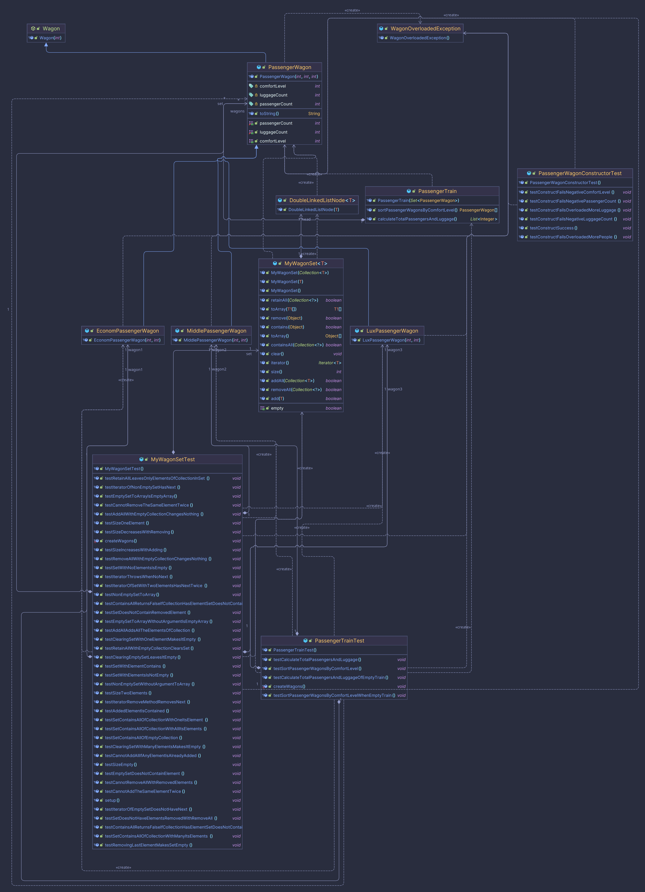

# Лабораторні роботи 6-8 студента групи ІМ-12 Сутулова Нікіти Олеговича

[Умови лабораторних робіт знаходяться тут.](https://asdjonok.github.io/OOP-SITE/)

Для того, щоб запустити програму, необхідно встановити Apache Maven. Після чого, перейшовши до кореневої папки проєкту, у терміналі ввести наступну команду:
```shell
$ mvn clean package && java -cp target/lab6-1.0-SNAPSHOT.jar com.nikitasutulov.lab6.Main 
```

# Лабораторна робота №6 студента групи ІМ-12 Сутулова Нікіти Олеговича

Тема:
Наслідування та поліморфізм.

Мета:
Ознайомлення з механізмом наслідування та принципом поліморфізму.
Використання механізму наслідування та принципу поліморфізму в мові
Java. Здобуття навичок у використанні механізму наслідування та принципу
поліморфізму.

Номер залікової книжки: 1229
- С13 - остача від ділення номера залікової книжки на 13:   
  = 1229 % 13 = 7 => **Визначити ієрархію рухомого складу залізничного транспорту. Створити
  пасажирський потяг. Порахувати загальну чисельність пасажирів і багажу в
  потязі. Провести сортування вагонів потягу за рівнем комфортності. Знайти
  вагон в потязі, що відповідає заданому діапазону кількості пасажирів.**

UML-діаграма класів:


# Лабораторна робота №7 студента групи ІМ-12 Сутулова Нікіти Олеговича

Тема:
Робота з колекціями в мові програмування Java.

Мета:
Здобуття навичок у створенні власних та використанні стандартних колекцій в мові програмування Java.

Номер залікової книжки: 1229
- С2 - остача від ділення номера залікової книжки на 2:   
  = 1229 % 2 = 1 => **Set**
- C3 - остача від ділення номера залікової книжки на 3:
  = 1229 % 3 = 2 => **Двозв'язний список**

UML-діаграма класів:


# Лабораторна робота №8 студента групи ІМ-12 Сутулова Нікіти Олеговича

Тема:
Обробка виключних ситуацій та основи тестування в мові програмування Java.

Мета:
Здобуття навичок у використанні механізму обробки виключних ситуацій та написанні тестів для перевірки працездатності методів в мові програмування Java.

UML-діаграма класів:

